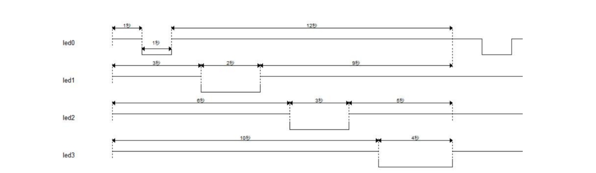

4位闪烁灯实验

波形图(Waveform graph)

#### <b>设计目标</b>
本实验的设计目标是我们要设计四个LED灯。我们规定高电平时，灯处于暗的状态，低电平时，灯处于亮的状态。如上图所示，首先 LED1暗 1 秒，接着亮 1 秒后变暗；接着 LED2 暗 1 秒，亮 2 秒后变暗；随后 LED3 暗 1 秒，亮 3 秒后变暗；最后 LED4 暗 1 秒，亮 4 秒后变暗；至此一个循环结束，随后按照此规律进行循环往复。也就是说，四个 LED 灯依次循环闪烁，具体闪烁要求为：隔 1 秒，亮 N 秒，N 的变化为：1，2，3，4 秒，然后再次进入循环。
